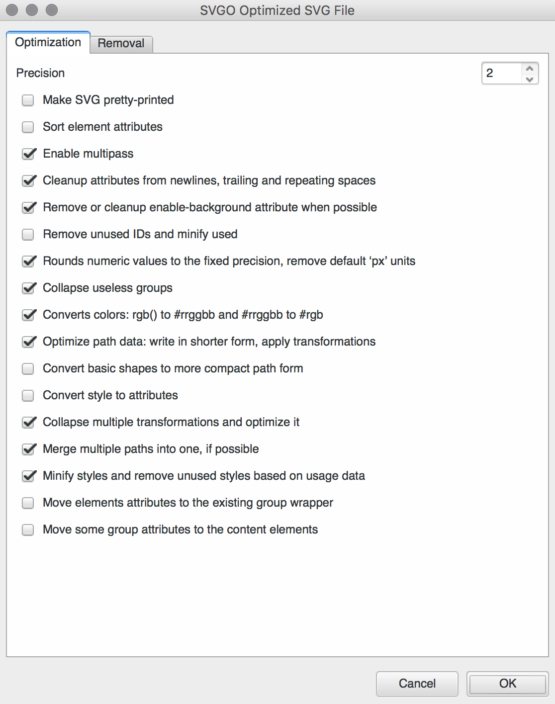
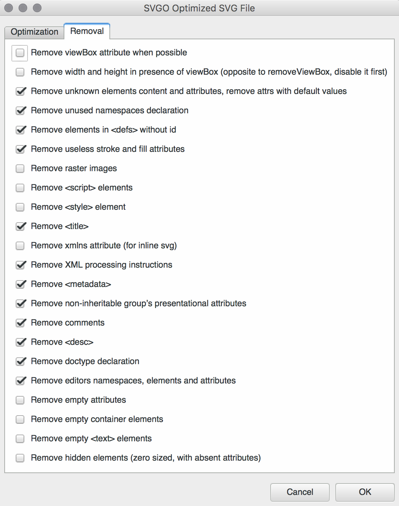

# inkscape-svgo

Optimize your SVGs with the awesome [svgo](https://github.com/svg/svgo).

## installation

Run `npm i -g konsumer/inkscape-svgo`

Then copy `inkscape-svgo.inx` to your extensions directory.

On my system, I went to "preferences" and it showed this as "User extensions" under "System":

```
/Users/konsumer/Library/Application Support/org.inkscape.Inkscape/inkscape/extensions
```

So, I used that path.

After this, find the option `SVGO Optimized SVG File (*.svg)` under File/Save As.

 
